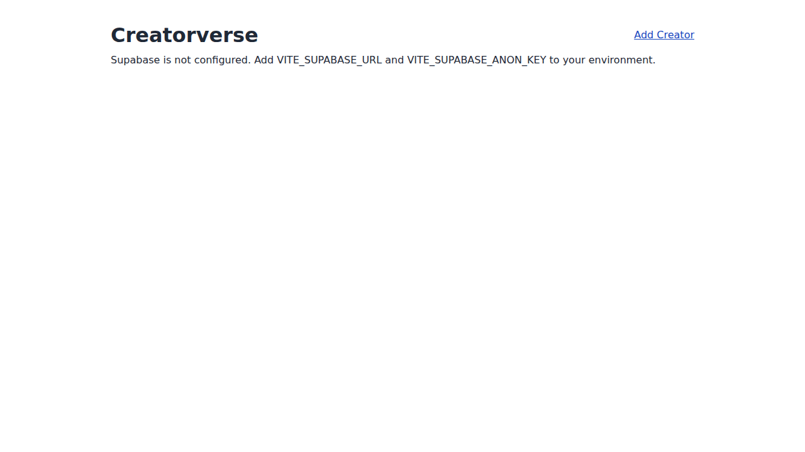

# WEB103 Creatorverse Prework

An interactive React + Supabase CRUD app for tracking favorite content creators.

## Completed Required Features

- [x] Home page fetches creators from Supabase on mount with `async/await`
- [x] Home page displays creator cards with name, external URL, and description
- [x] React Router routes for list, details, add, and edit views
- [x] Creator details page fetches one record by URL `id`
- [x] Add form inserts a creator into Supabase
- [x] Edit form preloads creator data and updates by `id`
- [x] Delete action removes creator by `id` and returns to home
- [x] Controlled form inputs for add/edit pages
- [x] Loading, empty, and basic error states on data-fetching pages
- [x] Navigation links/back paths across list/detail/edit/create pages
- [x] Supabase client is instantiated in one shared module

## Completed Stretch Features

- [x] Optional `imageURL` is rendered on creator cards and detail pages
- [x] Confirmation prompt is shown before delete
- [x] Card/grid styling customization for creator list

## Setup

1. Install dependencies:
   ```bash
   npm install
   ```
2. Create a `.env` file in the project root:
   ```bash
   VITE_SUPABASE_URL=your_supabase_project_url
   VITE_SUPABASE_ANON_KEY=your_supabase_anon_key
   ```
3. Run locally:
   ```bash
   npm run dev
   ```

## Database Notes

Create a `creators` table in Supabase with:
- `id` UUID primary key (auto-generated)
- `name` text
- `url` text
- `description` text
- `imageURL` text

For prework development, row-level security can be disabled and realtime can be enabled.

## Video Walkthrough

- Add your walkthrough link here: `https://example.com/your-video`

## UI Screenshot


